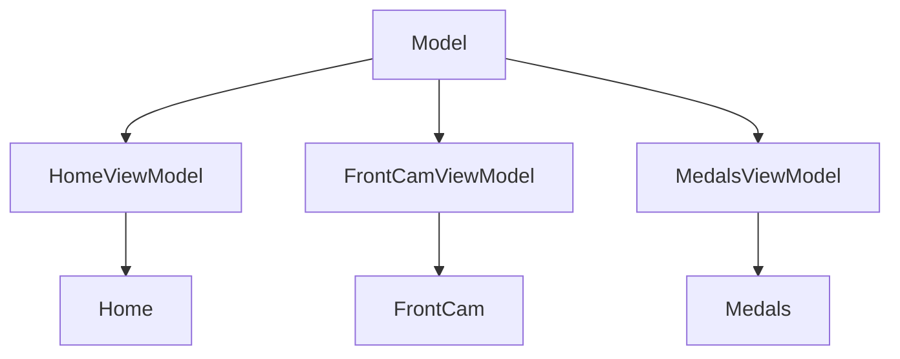

## Pushups and Masculinity

## Aim and Objectives

The primary aim of TitanUp is twofold: to bolster user upper body strength and fitness, and to cultivate sustainable, heath-positive masculine habits. Its objectives encompass:

1. __Regular Physical Activity Encouragement:__ TitanUp serves as a motivator for consistent physical engagement, utilising the simplicity of push-ups as an accessible exercise routine.
2. __Habitual Reinforcement:__ By integrating behavioural psychology principles, TutanUp endeavours to instill lasting healthy habits, facilitating seamless incorporation of exercise in to users' daily routines.
3. __Strength and Fitness Enhancement:__ Through regular push-up sessions, the app aims to progressively enhance users' physical preowess and overall fitness, fostering a sense of accomplishment and well-being.
4. __Enhancing User Experience with Machine Learning and AI:__ Leveraging the immersive capabilities of AI packages to detect push-ups using the front camera. TitanUp aims to redefine the exercise experience, making it interactive and inherently motivating.

## Methodology

TitanUp will be built using Swift, SwiftUI and QuickPose.ai Pose detection package for Swift. The incorporation of pose detection will add a layer of immmersion, transforming mundane exercise routines into an engaging experience.

The app's core functiionality is to accurately tracking users' push-up counts, leveraging the front camera to ensure precision and reliability. Additionally, personalised progress tracking and achievement systems will be integreated to provide user with feedback and incentives to stay committed to their fitness goals.

Once this has been achieved, the next step is to complete an open-source, free and native pose detection system for iPhone using CoreML and CreateML with model-building capabilities imported from MediaPipe or YOLOv7.

## Expected Outcomes

Users stand to reap multitude of benefits, extending beyond physical fitness:

* __Improved Physical Well-Being:__ Regular engagement with TitanUP will lead to tangible enhancements in strength, endurance, and overall physical well-being, empowering the user to lead a more active and filfilling live.
* __Cultivation of Healthy Habits:__ Through consistent reinforcement and habit-forming strategies, TitanUp aspires to instil enduring lifestyle changes, fostering a culture of health consciousness and self-care.
* __Enhanced User Engagement:___ The incorporation of AR technolofy will elevate user engagement levels, making exercise sessions not only effective but also enjoyable and immersive, thereby increasing long-term adherence and satisfaction.

# Start View

The first view the user will see.

## Concept

The app needed a familiar beginning to the onboarding process. A minimalist Start View was designed with a typical prompt to either login or register. So far, two themes have been created with more to come.

The app will have an automatic ID check that will skip this view and the login view and navigate to the user's home view once the user has logged in.

## Functionality

The view will need to access the login function via the view-model and the register view.

# Login View

## Concept

This will be the secure point-of-entry. It will be bypassed by the auto login, however will appear when the user's token expires. This will require the user to log in again.

## Functionality

This view will need to check user login credentials via the view-model. It will also have to access a password reset function and a register view. This will prevent the user from having to return to the start view.

# Home View

## Concept

This is the main screen. It will hold graphs and recent achievements under a profile panel. This will also hold smaller intra-day awards.

Currently, the home view will use a footer tab menu for navigation between the other screens, but this may change if the tab menu does not pop the other views. The main concern here is that open views may consume memory while hidden. This could cause a crash when entering the front camera as QuickPose does require a large amount of the device's memory.
## Functionality

This view will display the user's daily, weekly and monthly engagement. It will be visualised using graphs. The most recently awarded trophies will be placed below the graphs and medals will be visible within the profile panel. 

The profile image could either be a cartoon iamge selected from a list of available images, or a photo could be uploaded. 

# Tropy View

## Concept

This is a view that displays the user's awards. These are given on completion of set metrics. For example, the user could have completed:

* 3 days of pushups.
* 5 pushups.
* 5 pushups under 10 second.
* 10 pushups.
* 20 pushups
* 40 pushups
* 50 pushups
* 50 pusups in a day.
* 100 pushups in a day.
* 300 pushups in a day.

Motivation is the maiin focus of trophies.

## Functionality

Triggers will add the image to a list. This will then be displayed in a ViewList or a gridList (Don't know if this is a thing) so that awards will appear as they are awarded. 

The view will purposely feel empty at the beginning with the intention of motivatiing engagement. 

# Profile View

## Concept

This view will hold settings for the app and will allow the user to change the amount of pushups to be completed during a session.

It will also display options to change the app theme, change profile picture, and frequency of pushups throughout the day.

## Functionality

All toggle switch and drop down box values will be saved to a firebase document for persistence.

## MVVM

Model View View-Model is the most common pattern for mobile app development. However, some developers are pointing out the complexity of MVVM for SwiftUI. Many devs are moving to Model View Controller - or Model View, and Controller. But, for this project MVVM will be used.

The Model wwould contain structs that hold the user data. This object would then be used with the database quiery logic also held in the model.

Traditionally, the data quieries are used in the viewModels, but this would see a divergernce from the "Don't repeat yourself" programming principle as each viewModel would need its own database quiery. This could create repeated logic in each viewModel, therefore, datebase interaction would need to be built in the Model for use by all viewModels. 

MVVM could be seen as over-complicated for a simple app like TitanUp. The app could use up to 5 viewmodel objects, which seems an excessive use of memory. A single viewModel could be used for all views by using an @EnvironmentObject in the main view. This would update the single object.
